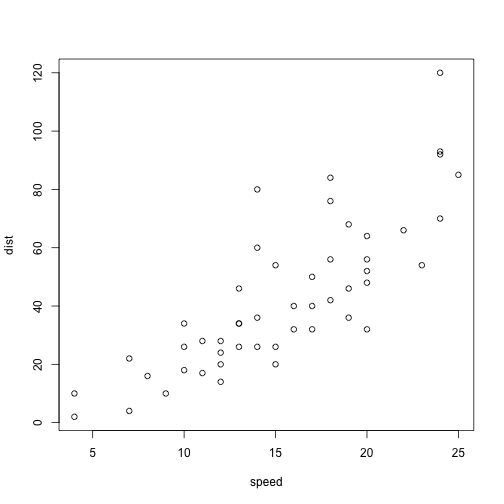

Deck Title Goes Here
========================================================
author: Sam Giles
date: 13th April 2020
autosize: true

Title of First Slide
========================================================

Text goes in here.

Title of Second Slide
========================================================

Add code blocks like in Rmd files.


```r
summary(cars)
```

```
     speed           dist       
 Min.   : 4.0   Min.   :  2.00  
 1st Qu.:12.0   1st Qu.: 26.00  
 Median :15.0   Median : 36.00  
 Mean   :15.4   Mean   : 42.98  
 3rd Qu.:19.0   3rd Qu.: 56.00  
 Max.   :25.0   Max.   :120.00  
```

Title of Third Slide
========================================================

The code blocks also take options just like in Rmd.



Title of Fourth Slide
========================================================

Not much more to say.

Title of Fifth Slide
========================================================

Thus ends the skeleton.
